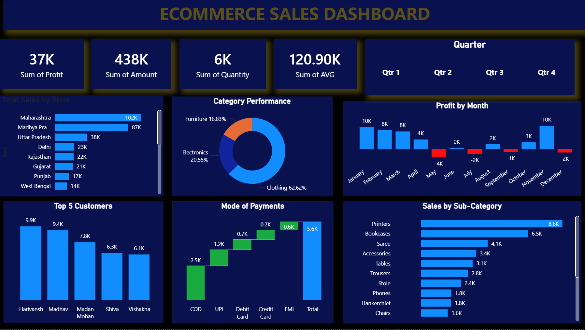

# Ecommerce Sales Dashboard – Power BI

## Project Overview
This project analyzes ecommerce sales data to evaluate revenue, profit, customer performance, and product trends using Power BI.

## Tools Used
- Power BI

## Dataset Description
The dataset contains ecommerce transaction data including:
- Customer and order details
- Product category and sub-category
- Sales amount, profit, and quantity
- Order date and payment mode

## What I Did
- Cleaned and transformed sales data
- Created KPIs for revenue, profit, and quantity
- Analyzed sales by category, state, and sub-category
- Evaluated monthly profit trends
- Designed an interactive dashboard with filters

## Key Insights
- Clothing category contributes the highest sales
- Certain states generate significantly higher revenue
- Profit fluctuates across months with seasonal impact
- Top customers contribute a large share of total sales

## Business Impact
This analysis helps businesses track performance, identify profitable products, and improve sales strategy.
## Dashboard Preview

