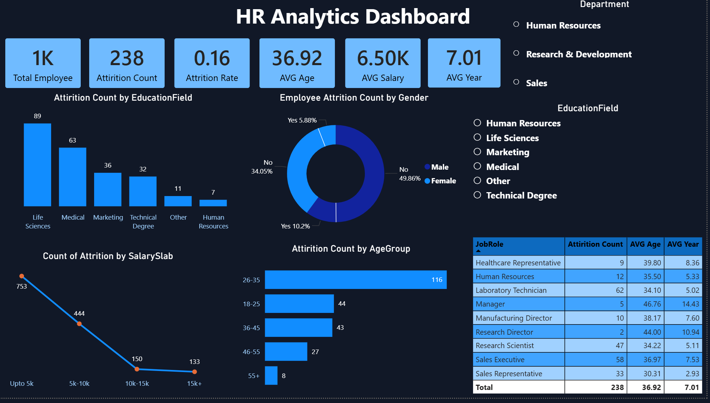

# HR Analytics Dashboard – Power BI

## Project Overview
This project analyzes employee data to understand attrition patterns, workforce demographics, and salary trends using Power BI.

## Tools Used
- Power BI

## Dataset Description
The dataset includes employee information such as:
- Department and job role
- Age, gender, and education field
- Salary and years at company
- Attrition status

## What I Did
- Cleaned and transformed employee data
- Built key HR KPIs including attrition rate and average salary
- Analyzed attrition by age group, gender, department, and education
- Designed an interactive Power BI dashboard for HR insights

## Key Insights
- Higher attrition observed in certain age groups and job roles
- Employees with lower salary slabs show higher attrition
- Research and Sales departments have higher attrition compared to others

## Business Impact
This analysis helps HR teams identify attrition drivers and improve employee retention strategies.

## Dashboard Preview

## Dashboard Preview

## Dashboard Preview

